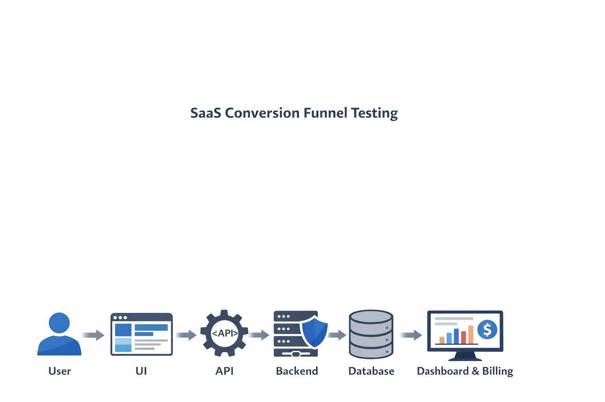

# 🚀 End-to-End QA Testing System for SaaS & FinTech

This repository demonstrates how **real production-style SaaS systems are tested end-to-end** — not just UI checks, but full validation across:

**UI → API → Backend → Database → Dashboard & Billing**

It is built around a Stripe-style SaaS conversion funnel and shows how QA can protect **conversion, revenue, data integrity, and customer trust**.

---

## 🧠 What Makes This Different

Most sample QA portfolios focus on page-level checks.

This repository focuses on:
- end-to-end workflow validation
- API and backend verification
- transaction consistency
- dashboard and billing accuracy
- business impact, not just feature behavior

That means the goal is not only to answer **“does the screen work?”** but also:
- was the correct request sent?
- was the correct data saved?
- did downstream systems update correctly?
- does the final report reflect the truth?

---

## 📊 End-to-End System Flow

**Visitor → Sign Up → Email Verification → Onboarding → API Key Generation → Sandbox Usage → Payment Execution → Dashboard Validation → Billing / Subscription**

From a QA perspective, the key validation path is:

**User → UI → API → Backend → Database → Dashboard & Billing**

This is where many critical SaaS defects appear:
- API failures hidden by UI success messages
- duplicate transactions caused by retries or repeated requests
- mismatched payment or billing states
- dashboard figures that do not match underlying transaction records

---

## 🎯 Scope Covered

This repository covers QA thinking and artifacts for:
- user sign-up and activation
- email verification
- onboarding and setup completion
- API key lifecycle and access control
- sandbox and integration readiness
- payment execution workflows
- dashboard validation
- billing and subscription handling
- data integrity across system layers

---

## 🔍 Core QA Focus Areas

- end-to-end system validation
- API request and response validation
- duplicate prevention and idempotency awareness
- transaction integrity and status consistency
- business-critical path coverage
- drop-off and conversion risk analysis
- reconciliation between UI, API, and reporting layers

---

## 🧪 Included Artifacts

### Test assets
- Manual Test Cases workbook
- API Test Scenarios workbook
- Postman collection
- Sample test data
- RTM and API RTM

### Strategy and analysis
- Funnel Overview
- Test Strategy
- Risk Assessment
- Defect Summary
- QA Thinking guide
- Decision Frameworks
- How to Test a SaaS Funnel guide

### Execution proof
- Sample QA Execution Summary

---

## 📌 Sample Execution Proof

This repo now surfaces example execution outcomes to show how the artifacts translate into real QA decisions.

**Sample results:**
- Total Tests: 7
- Passed: 2
- Failed: 5
- Pass Rate: 28%

**Key issues identified:**
- Duplicate payment allowed (**Critical**)
- Report / dashboard mismatch (**High**)
- API response inconsistency (**High**)
- Transaction delay under workflow conditions (**Medium**)

**Final QA Decision:**
**❌ NOT READY FOR RELEASE**

Why this matters:
- duplicate payments can lead to financial loss and disputes
- reporting mismatch damages trust and business visibility
- API inconsistencies create hidden downstream defects

See: [`sample-project/summary.md`](sample-project/summary.md)

---

## 💳 Why This Matters for SaaS & FinTech

In conversion-heavy and payment-enabled systems, quality issues directly affect:
- user activation
- conversion rate
- payment completion
- subscription continuity
- revenue recognition
- customer confidence

A missed bug in onboarding may reduce sign-up completion.
A missed bug in payment or billing can create **real financial impact**.

---

## 🤖 API Testing Coverage

This repository includes API validation for key funnel workflows such as:
- customer creation
- duplicate user handling
- payment intent creation
- payment confirmation
- payment status retrieval
- subscription creation and retrieval

Testing approach includes:
- status code and payload validation
- critical field assertions
- dynamic chaining using IDs and variables
- positive and negative coverage
- end-to-end API flow validation instead of isolated endpoint checks

---

## 💰 Premium QA System

A fuller commercial version of this system can include:
- full QA workbook bundle
- filled sample project
- QA guide / cheat sheet
- fintech-specific scenarios
- AI-assisted QA prompt pack

**Gumroad:** `[Add your Gumroad link here]`

---

## 🧪 QA Audit Service

I also use this approach as the basis for a lightweight QA audit service for:
- SaaS applications
- API-driven platforms
- onboarding funnels
- payment and billing workflows
- dashboard and data consistency reviews

Typical audit focus:
- workflow gaps
- API / backend inconsistencies
- duplicate or retry risks
- reporting mismatches
- release-readiness concerns

**Contact:** Ramon Tan Jr  
**Email:** ramonjrtan@gmail.com  
**GitHub:** [Ramonjrtan](https://github.com/Ramonjrtan)

---

## 👋 About Me

Senior QA Engineer with 20+ years of experience across:
- FinTech and payments
- SaaS platforms
- POS and transaction systems
- IoT and enterprise applications
- API and backend validation

I specialize in validating systems end-to-end, ensuring that workflows, transactions, and outputs remain accurate, reliable, and aligned with business expectations.

---

## Disclaimer

This is a personal QA portfolio project created for demonstration and learning purposes.

All workflows are generalized and do not contain proprietary or confidential information from any real company or client system.
